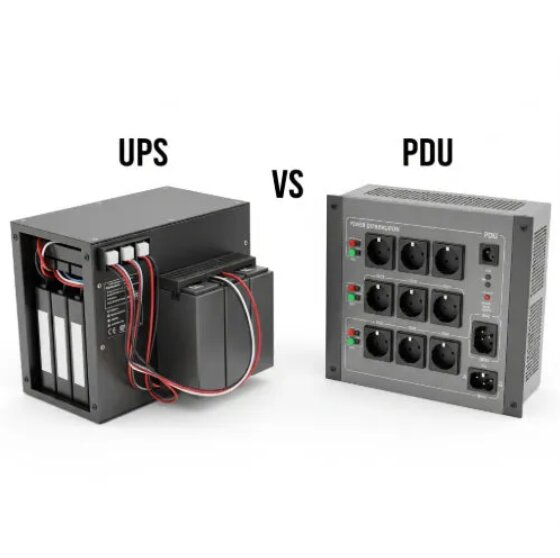
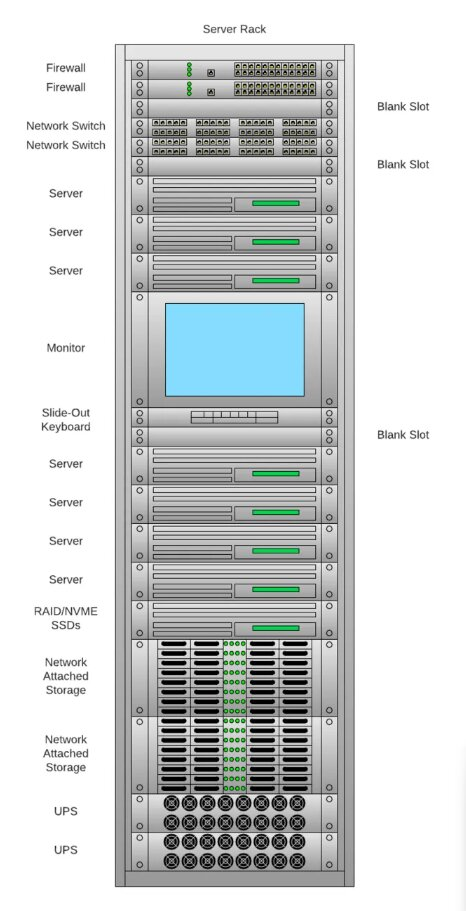
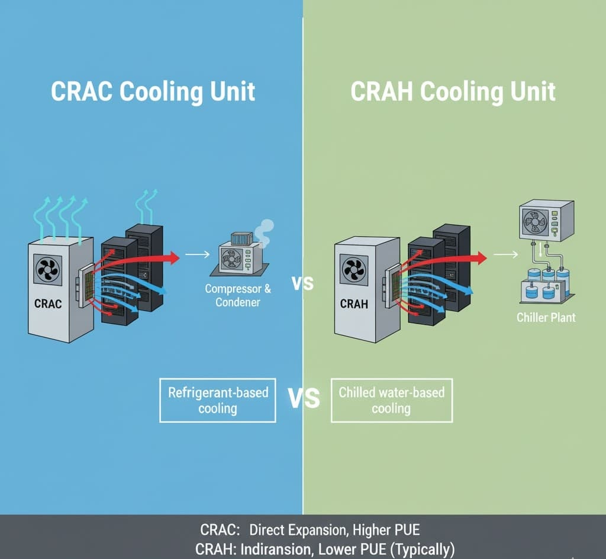

# Data Center Infrastructure Guide

Modern data centers rely on critical infrastructure systems to maintain **uptime, reliability, and operational continuity**.  
These systems provide stable power delivery, manage heat generated by servers, and monitor environmental conditions to ensure computing equipment operates safely and efficiently.  

Understanding how these systems work together is essential for roles in **data center operations, infrastructure engineering, and cloud platform support**.

---

## High-Level Infrastructure Flow

A simplified power and cooling path in many data centers:

### Power Flow
Utility Power 
↓ 
UPS System 
↓ 
Power Distribution Units (PDUs) 
↓ 
Server Racks & Networking Equipment

### Cooling Flow
CRAC / CRAH Cooling Systems 
↓ 
Cold Aisle Airflow 
↓ 
Server Intake 
↓ 
Hot Aisle Exhaust 
↓ 
Return Air to Cooling Systems

*These systems operate simultaneously to ensure computing hardware receives **stable power and controlled environmental conditions**.*

---

## UPS Systems

**Uninterruptible Power Supply (UPS)** provides temporary battery power during electrical outages or fluctuations.

### Key Functions
- Provides backup power during outages  
- Protects hardware from voltage spikes and brownouts  
- Stabilizes electrical supply  
- Allows backup generators time to start  

UPS systems typically provide **several minutes of runtime**, enough for backup generators to start or systems to shut down safely. Large facilities may deploy **centralized UPS systems** supporting entire rows or rooms.

---

## Power Distribution Units (PDUs)

**PDUs** distribute electrical power from UPS systems or facility sources to server racks and networking equipment.

### Types
- **Basic** – simple distribution, no monitoring  
- **Metered** – tracks power usage at rack level  
- **Switched** – allows remote power control for maintenance  

### Benefits
- Balances electrical loads  
- Prevents circuit overloads  
- Enables remote troubleshooting  
- Provides visibility into rack-level power consumption  

---

## Redundant Power

High availability environments require **redundant power**. Most data centers provide **dual power feeds** so servers remain online if one source fails.

### Common Redundancy Models
- **N** – minimum components to operate  
- **N+1** – one extra component beyond requirements  
- **2N** – two independent systems capable of full load  

This ensures maintenance or failure does not cause downtime.

---

## Rack Infrastructure

Servers and networking devices are mounted in **standard 19-inch racks (commonly 42U)**.

### Typical Components
- Rack-mounted servers  
- Network switches  
- Patch panels  
- Rack PDUs  
- Cable management systems  

### Benefits
- Improved cooling efficiency  
- Easier maintenance and hardware replacement  
- Cleaner cabling and organization  

---

## Cooling Systems

Servers generate significant heat; cooling keeps them within safe operating temperatures.

### CRAC – Computer Room Air Conditioner
- Self-contained cooling  
- Uses refrigerant compressors  
- Common in smaller data centers  

### CRAH – Computer Room Air Handler
- Uses chilled water loops from a centralized plant  
- More energy efficient at large scale  
- Common in enterprise facilities  

---

## Airflow Management

Proper airflow maximizes cooling efficiency and prevents thermal hotspots.

- **Cold Aisle** – cold air directed to front of servers  
- **Hot Aisle** – hot exhaust air contained at rear  

This separation reduces energy consumption and protects equipment.

---

## Monitoring & Environmental Systems

Continuous monitoring ensures data center systems operate within safe parameters.

### Metrics
- Temperature  
- Humidity  
- Power usage  
- Hardware health  
- Network performance  

### Tools
- Environmental sensors  
- Building Management Systems (BMS)  
- Data Center Infrastructure Management (DCIM) platforms  

Alerts notify technicians when systems exceed safe thresholds, enabling proactive maintenance.

---

## Typical Technician Responsibilities

- Install and rack servers & networking equipment  
- Connect redundant power feeds to PDUs  
- Verify power loads and prevent circuit overloads  
- Monitor environmental systems and respond to alerts  
- Replace failed hardware components  
- Trace cabling and document infrastructure  
- Perform preventative maintenance  

Understanding the relationships between power, cooling, and hardware is critical for **reliable operations**.

---

## Operational Importance

Reliable infrastructure ensures **uptime in enterprise and cloud computing**.  

Failures in power delivery, cooling, or monitoring can lead to outages or hardware damage. Data center technicians and engineers are responsible for:

- Monitoring and maintaining systems  
- Responding to alerts  
- Performing preventative maintenance  
- Ensuring redundancy works correctly  

Strong infrastructure knowledge is essential for supporting modern cloud platforms and enterprise computing environments.

---

## Skills Highlighted

- Power and cooling system management  
- Redundant system design & monitoring  
- Rack setup and hardware organization  
- Environmental monitoring and alerting  
- Troubleshooting and operational awareness  
- Technical documentation and workflow design
